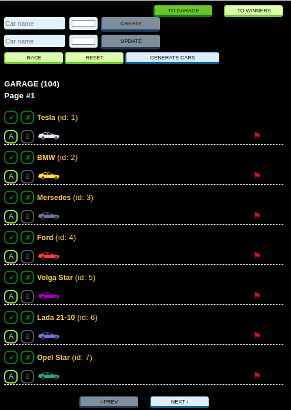
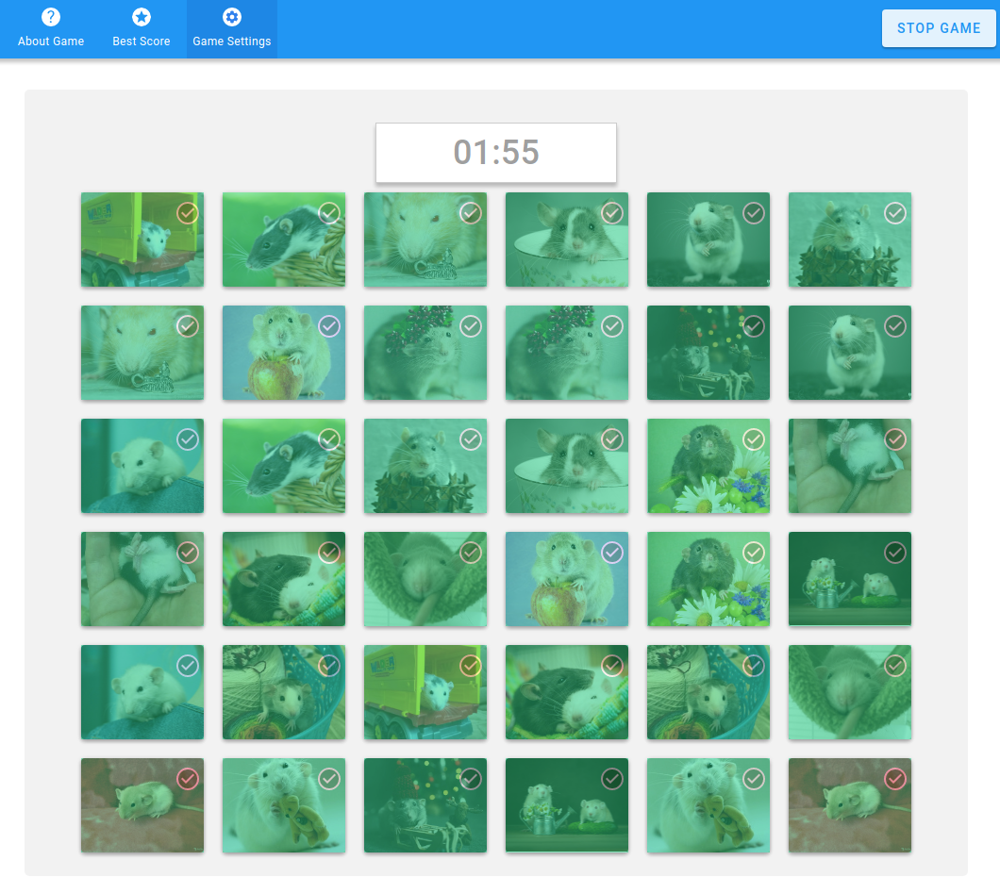
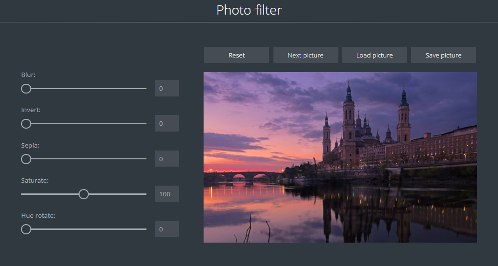
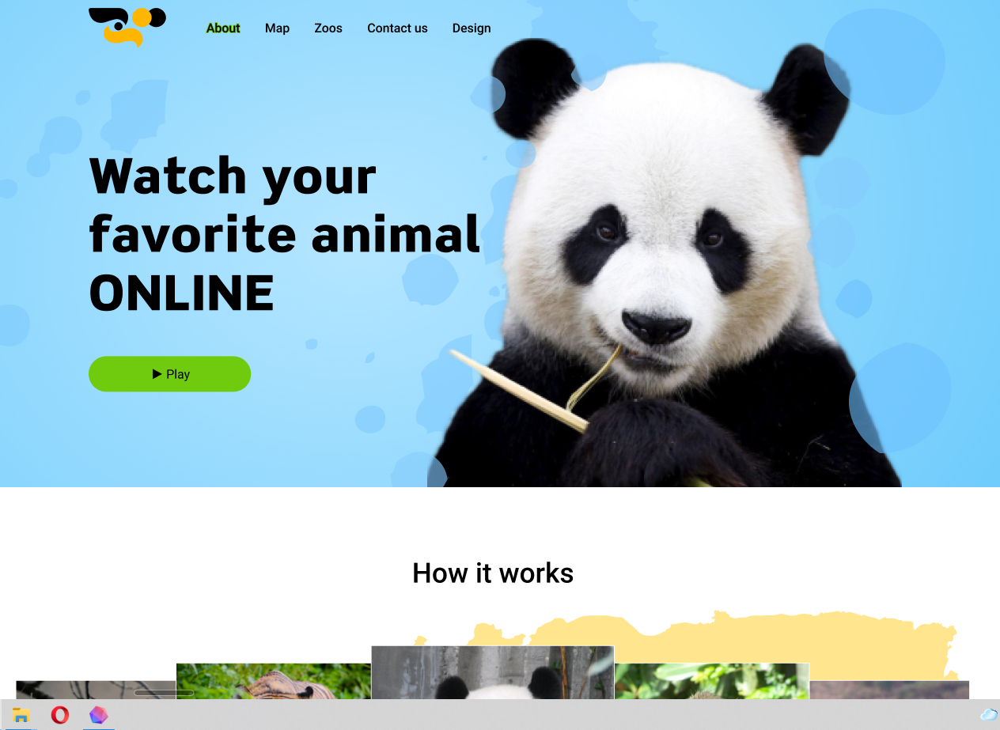
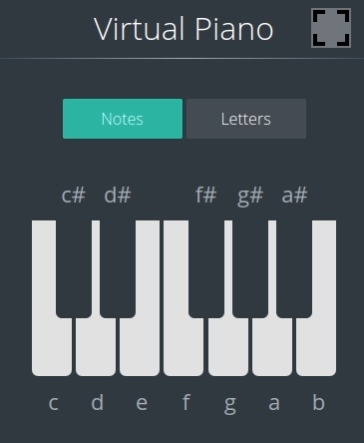
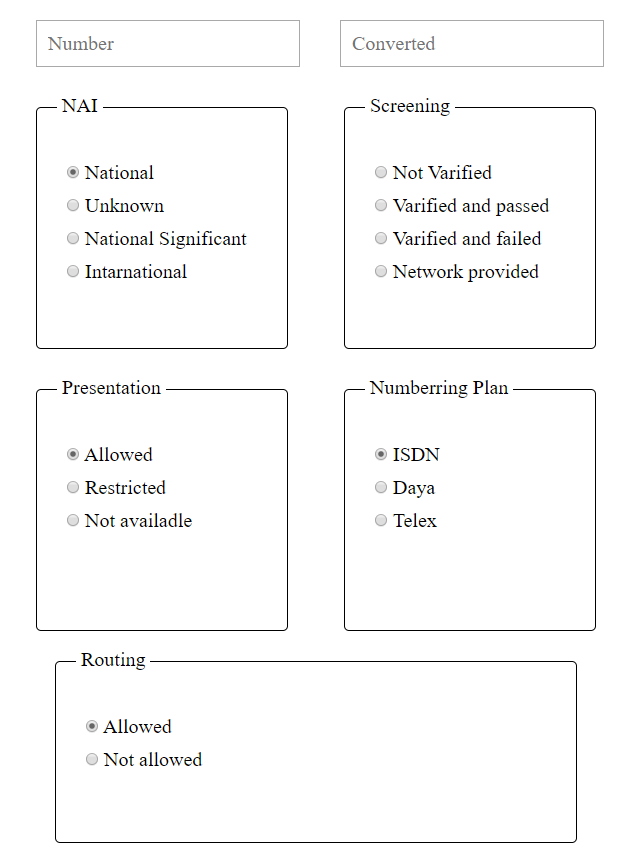
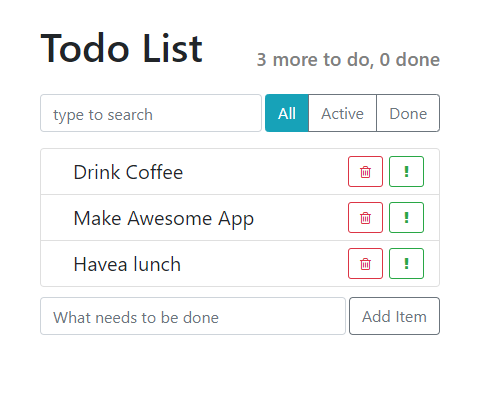

# Portfolio of Golubeva Marina

- CV: https://mor-11.github.io/RsShoole-CV/
- Portfolio: https://github.com/Mor-11/Portfolio

## SPA: Game Async-race

<table border="0">
<tr>
    <td>
        <ul>
            <li>Task: https://github.com/rolling-scopes-school/tasks/blob/master/tasks/async-race.md</li>
            <li>Work: https://rolling-scopes-school.github.io/mor-11-JSFE2021Q1/async-race/dist//</li>
            <li>Note: Reviewer should clone <a href="https://github.com/mikhama/async-race-api">repo with a server</a> and keep the server running during functionality review.</li>
            <li>Key skills: TypoScript, webpack, Сommunication with a server (fetch, REST API), Async coding / Promises, JS Animations, DOM Api</li>
            <li>Code (copy private repositories): https://github.com/Mor-11/RS-SCHOOLE/tree/async-race-ts</li>
            <li>15.06.2021</li>
    </td>
    <td width="40%">
        
    </td>
</tr>
</table>

## SPA: Match-Match Game

<table border="0">
<tr>
    <td>
        <ul>
            <li>Task: https://github.com/rolling-scopes-school/tasks/blob/master/tasks/match-match-game.md</li>
            <li>Work: https://rolling-scopes-school.github.io/mor-11-JSFE2021Q1/match-match-game/dist/</li>
            <li>Key skills: TypoScript, webpack, OOP</li>
            <li>Code (copy private repositories) : https://github.com/Mor-11/RS-SCHOOLE/tree/match-match-game </li>
            <li>31.05.2021</li>
    </td>
    <td width="40%">
        
    </td>
</tr>
</table>

## Photo-filter

<table border="0">
<tr>
    <td>
        <ul>
            <li>Task: https://rolling-scopes-school.github.io/stage0/#/stage1/tasks/js-projects/photo-filter</li>
            <li>Work: https://rolling-scopes-school.github.io/mor-11-JSFE2021Q1/photo-filter/index.html</li>
            <li>Key skills: work with files, upload local files, save files to computer, work with Date, Canvas API</li>
            <li>Code (copy private repositories) : https://github.com/Mor-11/RS-SCHOOLE/tree/photo-filter </li>
            <li>24.04.2021</li>
    </td>
    <td width="40%">
        
    </td>
</tr>
</table>

## Online-zoo - animal observation site

<table border="0">
<tr>
    <td>
        <ul>
            <li>Task: https://rolling-scopes-school.github.io/stage0/#/stage1/tasks/online-zoo/variant-4</li>
            <li>Work: https://mor-11.github.io/online-zoo/online-zoo/index.html</li>
            <li>Key skills: layout for desktop skrins, adaptive for 1920px, 1200px. JS: multi-popups whith form, automatic carousel, sliders: horizontal and vertical</li>
            <li>Code: https://github.com/Mor-11/RS-SCHOOLE/tree/online-zoo </li>
            <li>April 2021</li>
    </td>
    <td width="40%">
        
    </td>
</tr>
</table>

## Virtual-piano

<table border="0">
<tr>
    <td>
        <ul>
            <li>Task: https://rolling-scopes-school.github.io/stage0/#/stage1/tasks/js-projects/virtual-piano</li>
            <li>Work: https://github.com/rolling-scopes-school/mor-11-JSFE2021Q1/virtual-piano</li>
            <li>Key skills: work with DOM, work with sound, work with Fullscreen API, mouse events, keyboard events</li>
            <li>Code (copy private repositories): https://github.com/Mor-11/RS-SCHOOLE/tree/virtual-piano</li>
            <li>17.03.2021</li>
    </td>
    <td width="40%">
        
    </td>
</tr>
</table>

## Parsing Page

<table border="0">
<tr>
    <td>
        <ul>
            <li>Task: https://mor-11.github.io/EpolSoft/Parsing%20Page/</li>
            <li>Work: https://github.com/EpolSoft/TelcoTest/wiki/Parsing-Page</li>
            <li>Code: https://github.com/Mor-11/EpolSoft</li>
            <li>17.03.2021</li>
    </td>
    <td width="40%">
        
    </td>
</tr>
</table>

## TodoList

<table border="0">
<tr>
    <td>
        <ul>
            <li>Code: https://github.com/Mor-11/Todo-list</li>
            <li>23.07.2021</li>
            <li>Code: https://github.com/Mor-11/Todo-list</li>
            <li>Key skills: React</li>
    </td>
    <td width="40%">
        
    </td>
</tr>
</table>
